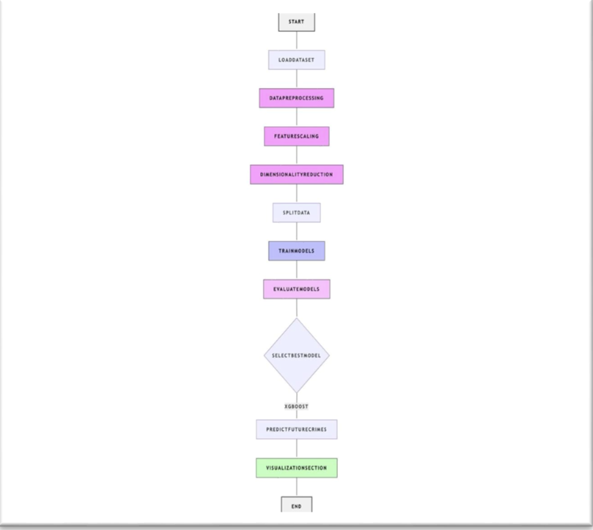
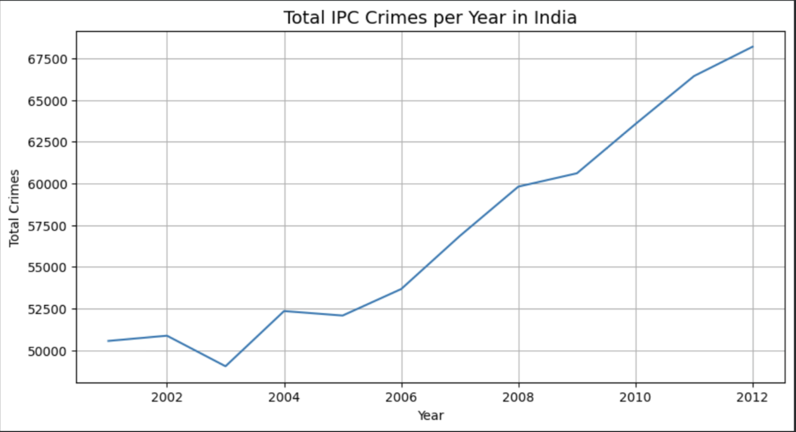
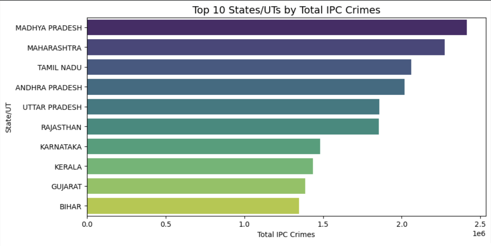
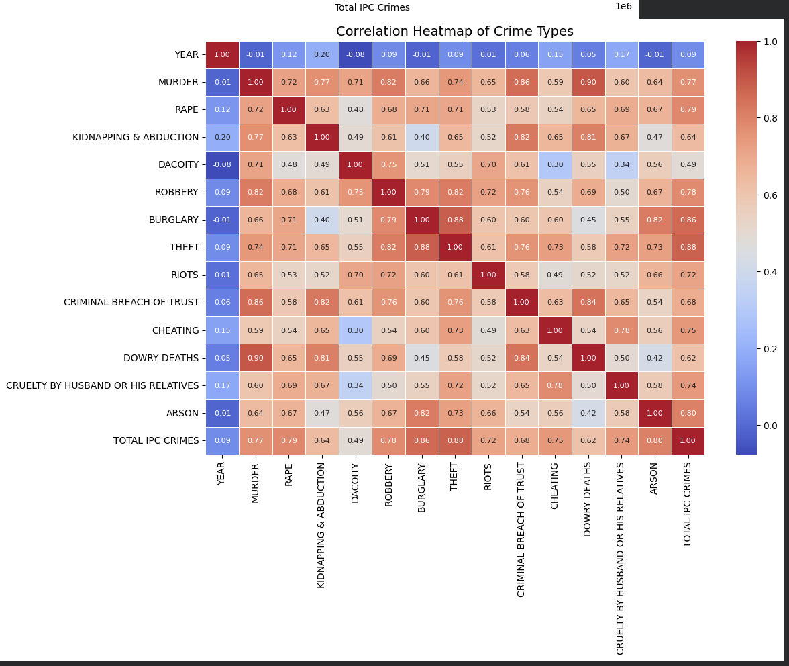
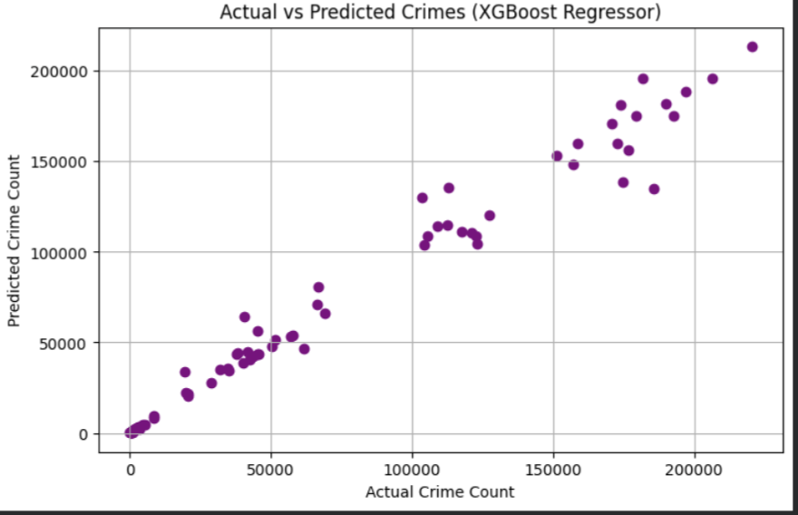

# Crime Rate Prediction Using Machine Learning

This project analyzes and predicts crime rates in India using machine learning techniques.  
It performs data preprocessing, visualization, feature reduction using PCA, and applies multiple regression models to identify the **best-performing algorithm for crime prediction**.

---

 📌 Project Objectives
- Analyze crime patterns across Indian States/UTs  
- Visualize crime distribution and trends  
- Reduce dimensionality using PCA  
- Compare multiple ML regression models  
- Predict Total IPC Crimes with best accuracy  

---

📂 Dataset Used
- **newtrial - Sheet 1 - 01_District_wise_crim 2.csv**
- Contains crime statistics across:
  - 35+ States/UTs  
  - 16+ crime categories  
  - Years 2001–2012  

---

🧹 Data Preprocessing
- Cleaned column names  
- Removed non-required attributes  
- Filtered only major crime categories  
- Handled missing/invalid entries  
- Performed **feature scaling** before PCA  

---

 🧠 Machine Learning Models Used
| Model Type | Description |
|-----------|-------------|
| Linear Regression | Baseline model |
| Decision Tree | Non-linear modeling |
| Random Forest | Ensemble-based |
| SVM (Linear, Poly, RBF, Sigmoid) | All kernels tested |
| KNN Regressor | Distance-based |
| **XGBoost Regressor** | 🌟 **Best performing model** |
| PCA | Reduced 9 features → 6 components |

---

 🏆 Best Model  
XGBoost Regressor**
- Highest R² score  
- Lowest RMSE  
- Best error performance  

---

 📊 Visualizations

 🔹 1. Flowchart of Project Workflow**

---

 🔹 2. Line Plot — Total IPC Crimes per Year**
Shows year-wise rising trend in crime.  

---

🔹 3. Top 10 States/UTs by Crime Count**
Visualizes states with highest crime burden.  

---

🔹 4. Correlation Heatmap of Crime Types**
Shows which crimes are highly correlated with overall total crimes.  

---

### 🔹 **5. Combined Model Performance Table / Additional Graph**
Any extra graph generated during analysis.  

---

 📘 **Project Notebook**

👉 Click to open the full code:  
[**crime_prediction.ipynb**](crime_prediction.ipynb)

Includes:
- Data cleaning  
- PCA  
- ML models  
- Evaluation metrics  
- Graph generation  

 ---

📄 **Full Project Report (PDF)**  
Click to view detailed explanation:

👉 [**Report.pdf**](Report.pdf)

---

📜 License
This project is released under the **MIT License**.

---

👤 Author
Palak Tyagi

---

 ⭐ How to Run the Project
1. Clone the repository  
2. Install dependencies  
3. Run the Jupyter Notebook  
4. View predictions and graphs  

---

